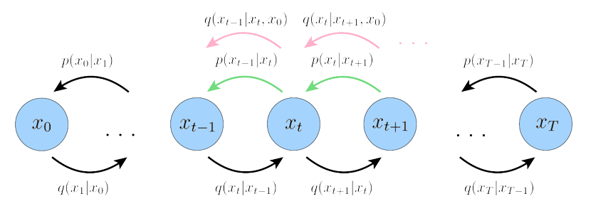

# Diffusion Models Presentation with MARP


<p align="center">
  
</p>

This repository contains a presentation on Diffusion Models created using [MARP](https://marp.app/).


## View and Edit the Presentation

To view the presentation download [vdm.pdf](https://github.com/zelaki/vdm_presentation/blob/master/vdm.pdf).

If you want to edit the presentation:

1. Clone the repository to your local machine:

   ```bash
   git clone https://github.com/zelaki/vdm_presentation.git
    ```
2. Open the vdm.md file in a Markdown editor or a text editor that supports Markdown.
3. If you have [MARP](https://marp.app/) installed, you can open and preview the presentation directly. If not, you can use the online MARP editor to copy and paste the content for a live preview.

