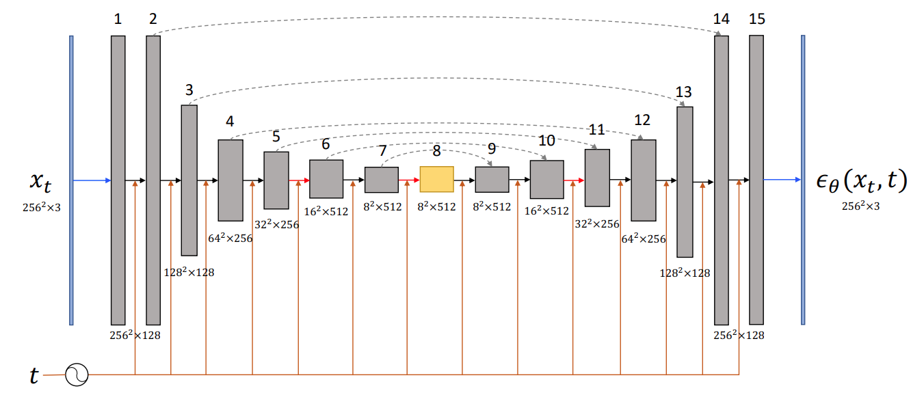
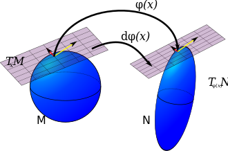
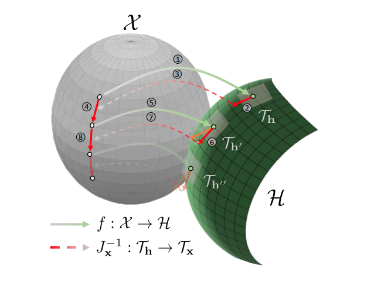
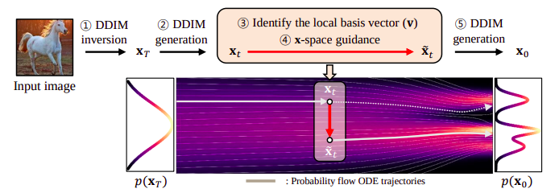

### Interpretable Latent Directions in DPMs 

 
 

-  Diffusion Models Already Have A Semantic Latent Space (ICLR 2023)
-  Discovering Interpretable Directions in the Semantic Latent Space of Diffusion Models (Submitied CPVR 2023 ?)
-  Understanding the Latent Space of Diffusion Models through the Lens of Riemannian Geometry (NIPS 2023)

---

### Papers Presented

-  Diffusion Models Already Have A Semantic Latent Space 
(ICLR 2023)
-  Discovering Interpretable Directions in the Semantic Latent Space of Diffusion Models 
(Submitied CVPR 2023 ?)

-  Understanding the Latent Space of Diffusion Models through the Lens of Riemannian Geometry 
(NIPS 2023)

---

##### Diffusion Models Already Have A Semantic Latent Space 

 

-  Main Results:

  -  *h-space*: 

  -  *Asymetric Reverse Process*: Small changes in UNet dont effect the inference

---

###### Diffusion Models Already Have A Semantic Latent Space 

-  *h-space*:

  -  $\Delta h_t$ has the same semantic effect on different samples

  -  Scaling $\Delta h$ controls the magnitude of attribute chang

  -  Adding multiple ∆h manipulates the corresponding multiple attribute

---

##### Diffusion Models Already Have A Semantic Latent Space 

-  Why *Asymmetric Reverse Process*:

  -  Let $\epsilon_\theta^t$ be a predicted noise  
  
  -  Let $\hat{\epsilon}_\theta^t = \epsilon_\theta^t + \Delta \epsilon$ be its shifted counterpart. 
  -  Then, $\Delta x_t = \hat{x}_{t−1} − x_t$ is negligable.
---

##### Diffusion Models Already Have A Semantic Latent Space 

-  How to they perform editing?:

  -  Asyrp: $x_{t-1} = \sqrt{a_{t-1}}P_t(e^\theta_t(x_t|h_t + f(h_t))) + D_t(e^\theta_T(x_t))$
  
  -  Loss: $(1-\lambda)\mathcal{L}_{CLIP} + \lambda \mathcal{L}_{rec}$ 
  -  They only train $f$.
---

##### Preliminaries

-  Push-Forward
<!-- -  Metric Pullback -->
-  SVD of a Jacobian

---

##### Push-Forward

-  A linear approximation of smooth maps on tangent spaces.
-   Let, $\phi: M \rightarrow N$
-  For $x \in M$, the *Jacobian* of $\phi$ at $x$ is a linear map between their tangent spaces:
  $J_\phi:T_x M \rightarrow T_{\phi(x)} N$

---

##### SVD of the Jacobian

-  Let $J_\phi: T_x M \rightarrow T_{\phi(x)} N$.

-  Then $J_\phi = U \Sigma V^*$:
  -  $u_1, ..., u_m$ of $U$ yield an orthonormal basis of $T_x M$
  -  $v1, ..., v_n$ of $V$ yield an orthonormal basis of $T_{\phi(x)} N$
  -  $v_i$ directions in the input space that are most influential for the changes in the output space.

---

###### Understanding the Latent Space of Diffusion Models through the Lens of Riemannian Geometry

-  Main Ideas:

  *  $\mathcal{H}$ (bottleneck) exibits local linearity but $\mathcal{X}$ doesnt.

  *  The unet encoder is a function $f: \mathcal{X} \rightarrow \mathcal{H}$

  *  Let $T_x$ and $T_h$ be tangat spaces at $x\in \mathcal{X}$ and $h \in \mathcal{H}$ respectivly.
  
  *  The Jacobian $J_x = \nabla_x h$ is a linear map, $J_x: T_x \rightarrow T_h$

---

###### Understanding the Latent Space of Diffusion Models through the Lens of Riemannian Geometry

*  The right singular values $v_i$ of $J_x$ give $n$ semantic directions in $T_x$ that show
large variability of the corresponding $u \in T_h$

*  The corresponding directions in $T_h$ (left singular values): $u_i = \frac{1}{\sigma_i} J_x v_i$

---

##### Editing

 1. Map a sample in X into a
tangent space $T_h$ in H.

 2. Choose a direction in $T_h$.

 3. Find its corresponding direction in X using $J_x^{-1}$.

 4. Edit the sample by adding the discovered direction.

 5. Map the edited sample to a new tangent space $T_h'$ in $\mathcal{H}$ for multiple editing.

 6. Project to new tangent and goto 3.

--- 

##### In a new version of the paper 

 1. Map a sample in X into a
tangent space $T_h$ in H.

 2. Choose a direction $u_i \in T_h$.

 3. Find its corresponding direction $v_i \in T_x$ using $J_x^{-1}$.

 **4. $\mathbb{\hat{x_t} = x_t + \gamma [e_\theta(x_t + v_i) - e_\theta(x_t)]}$**

---

##### Important Notes

*  The editing is performed in a single timestep.

 
 

---

##### Important Notes

*   They vectorize $x\in \mathcal{X}$ and $h \in \mathcal{H}$, thus:

  *   $x \in \mathcal{X} \subset R^n$, $n=256 \cdot 256 \cdot 3$  
  *   $h \in \mathcal{H} \subset R^m$, $m=8 \cdot 8 \cdot 1280$
  *  Thus the Jacobian $J \in R^{m \times n}$.

 *  Could we keep the tensorial structure and do HOSVD?

---

###### Discovering Interpretable Directions in the Semantic Latent Space of Diffusion Models

*   They take the Jacobian $e_\theta$ with respect to $h$, $J = \frac{\partial e_t^{\theta}(x_t, h_t)}{\partial h_t}$ (everything is vectorized).

*  The right singulare vectors are directions in $\mathcal{H}$ that cause the largest change in $e_t^{\theta}$

*    

<!--  -->

