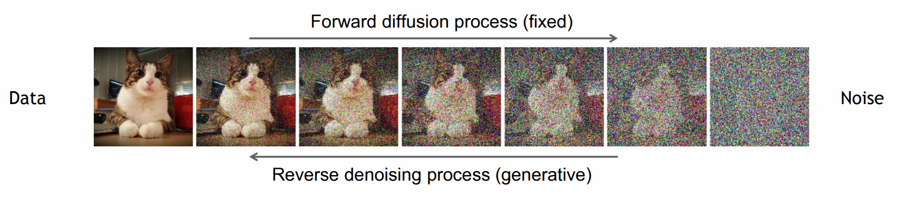
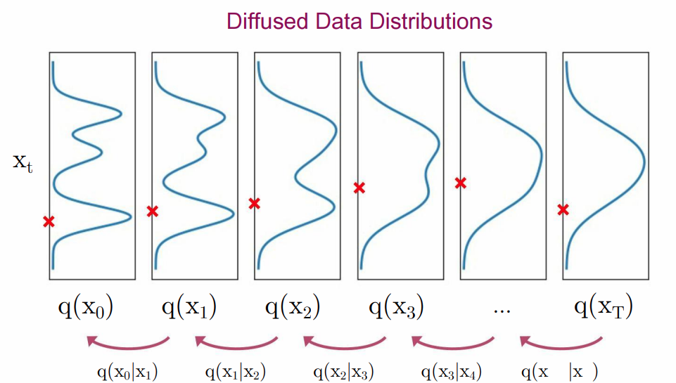
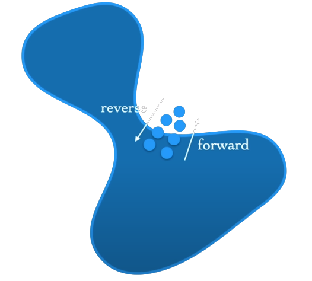
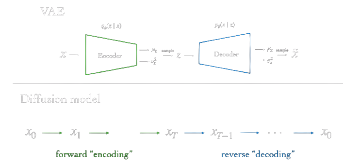
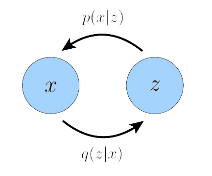

# Diffusion Models
An Introduction

---

### Learning to Generate by Denoising

- ##### Diffusion models consist of two processes:

    -  Forward process that gradually adds noise to input. 
    -  Reverse process that learns to generate data by denoising.

---

### Forward Process

- ##### The definition of the forward process in T steps:

    - Posterior: $q(x_{1:T} | x_0 ) = \prod^T_{t=1} q(x_t \vert x_{t-1})$,
    - where $q(x_t \vert x_{t-1}) = \mathcal{N}(x_t; \sqrt{1-\beta_t}x_{t-1}, \beta_t I)$

---
### Characteristics of the forward process

- Markov Chain.
- Generally $\beta_t \in (0,1)$ follows a fixed linearly increasing schedule.
- As $T\rightarrow \infty$, $q(x_t|x_0) \approx \mathcal{N}(0,I)$.
- If we set a large enough $T$ we can set $\beta_t\ll1$. 

---
### Backward Process

-  We have to approximate $q(x_{t-1} | x_t)$. 

-  We can use model $q(x_{t-1} | x_t)$ as a Normal Distribution is $\beta_t$ is small. 

---

#### Definition of the Backward Process

-  We will model the true reverce process $q(x_{t-1}|x_t)$ with $p_{\theta}(x_{t-1}|x_t)$. 

- $p_{\theta}(x_T) = \mathcal{N}(x_T; 0, I).$
- $p_{\theta}(x_{t-1}|x_t) = \mathcal{N}(x_{t-1}; \mu_{\theta}(x_t,t), \sigma_t^2 I)$
---

#### What objective will we optimize?

-  Maximize $p_{\theta}(x_0) ?$ 

- $p_{\theta}(x_0) = \int p_{\theta}(x_{0:T})dx_{1:T}$  

---

#### What objective will we optimize?

- Marginalizing oven all possile trajectories is intracable.

- $p_{\theta}(x_0) = \int p_{\theta}(x_{0:T})\underline{dx_{1:T}}$  

---

---

##### Mininize the Evidence Lower Bound (ELBO)
- The evidence is quantified as the log likelihood of the observed data.
- Maximizing the ELBO becomes a proxy objective with which to optimize a latent variable model.

-  $\log p(x) \geq \mathbb{E}_{q_{\phi}(z|x)}[log(\frac{p(x,z)}{q_{\phi}(z|x)})]$

---

## Derivation of the Evidence Lower Bound (ELBO)

$$
\begin{align}\log p(x) &=  \int \log p(x) q_{\phi}(z|x)dz && (\int q(z|x) dz = 1)\\

&=\mathbb{E}_{q_{\phi}(z|x)}[\log p(x)] && (\text{By Definition of } \mathbb{E}) \\
&=\mathbb{E}_{q_{\phi}(z|x)}[\log \frac{p(x,z)}{p(z|x)}] && (\text{Chain rule})\\
&=\mathbb{E}_{q_{\phi}(z|x)}[\log \frac{p(x,z)}{q_{\phi}(z|x)}] + \mathbb{E}_{q_{\phi}(z|x)}[\log \frac{q_{\phi}(z|x)}{p(z|x)}] && (\text{Multiple by } \frac{q_{\phi}(z|x)}{q_{\phi}(z|x)} \text{ and split})\\
&=\mathbb{E}_{q_{\phi}(z|x)}[\log \frac{p(x,z)}{q_{\phi}(z|x)}] + D_{KL}(q_{\phi}(z|x)||p(z|x)) && (\text{By definition of } D_{KL}) \\
&\geq \mathbb{E}_{q_{\phi}(z|x)}[\log \frac{p(x,z)}{q_{\phi}(z|x)}] && (D_{KL} > 0)

\end{align}
$$

---

###### Diffusion Models as Hierarchical VAEs

-   The latent dimension is exactly equal to the data dimension.
-  The the latent encoders $q$  not learned; it is pre-defined as a linear Gaussian model.
-  The Gaussian parameters of the latent encoders vary over time in such as the latent at final timestep T is $\mathcal{N}(0,I)$.
---

## An ELBO for the Diffusion Model

$$
\begin{align}\log p(x) &\geq  \mathbb{E}_{q(x_{1:T}|x_0)}\left[ \log \frac{p(x_{0:T})}{q(x_{1:T}|x_0)} \right ]\\

&= \mathbb{E}_{q(x_{1:T}|x_0)}  \left[log \frac{p(x_T) \prod_{t=1}^T p_{\theta}(x_{t-1}|x_t)}{\prod_{t=1}^T q(x_t|x_{t-1}, \mathbin{\color{red}x_0})}\right]  && (\text{Due to Markovian Property }\mathbin{\color{red}q(x_t|x_{t-1}) = q(x_t|x_{t-1},x_0)})\\

&= \mathbb{E}_{q(x_{1:T}|x_0)}  \left[ 
\log \frac{p_{\theta}(x_T) p_{\theta}(x_0|x_1)}{q(x_1|x_0)} + \log \prod_{t=2}^T  \frac{p_{\theta}(x_{t-1}|x_t)}{q(x_t|x_{t-1},x_0)} 
\right] && (\text{1st term out of product and split.})\\

&= \mathbb{E}_{q(x_{1:T}|x_0)}  \left[ 
\log \frac{p_{\theta}(x_T) p_{\theta}(x_0|x_1)}{q(x_1|x_0)} +
\log \prod_{t=2}^T  
\frac{p_{\theta}(x_{t-1}|x_t)}{\frac{q(x_{t-1}|x_T,x_0) \mathbin{\color{green}q(x_t|x_0)} }
{\mathbin{\color{green}q(x_{t-1}|x_0)}}} 
\right] && (\text{Bayes rule}) \\

&= \mathbb{E}_{q(x_{1:T}|x_0)}  \left[ 
\log \frac{p_{\theta}(x_T) p_{\theta}(x_0|x_1)}{q(x_1|x_0)} +
\log(\frac{\mathbin{\color{green}q(x_1|x_0)}}{\mathbin{\color{green}q(x_T|x_0)}})
+\log \prod_{t=2}^T  \frac{p_{\theta}(x_{t-1}|x_t)}{q(x_t|x_{t-1},x_0)} 
\right] &&
(\mathbin{\color{green}\text{Only the first and last term survive.}}) \\

&= \mathbb{E}_{q(x_1|x_0)}  
\left[ 
\log  p_{\theta}(x_0|x_1)
\right] +

\mathbb{E}_{q(x_T|x_0)}  
\left[ 
\log  \frac{p_{\theta}(x_T)}{q(x_T|x_0)}
\right] +
\sum_{t=2}^T \log \frac{p_{\theta}(x_{t-1}|x_t)}{q(x_t|x_{t-1},x_0)} && (\text{Get log inside product})
\end{align}
$$

---

### An ELBO for the Diffusion Model

 
 

$$
\begin{align}
\log p(x) &\geq 
\mathbb{E}_{q(x_1|x_0)}  
\left[ 
\log  p_{\theta}(x_0|x_1)
\right] && (L_0:\text{ Reconstruction term})\\
&-
D_{KL}(q(x_T|x_0) || p(x_T)) && (L_T:\text{Prior matchng term}) \\

&-
\sum_{t=2}^T  \mathbb{E}_{q(x_t|x_0)}
\left[
D_{KL}(q(x_{t-1}|x_t, x_0) || p_{\theta}(x_{t-1} | x_t))
\right]
&& (L_{t-1}:\text{Denoising matching term}) \\

\end{align}
$$

 
 

- $L_0$: Can be approximated and optimized using a Monte Carlo estimate.
- $L_T$: Equal to zero under our assumptions since $q(x_T | x_0) \approx p(x_T) = \mathcal{N}(0,I)$
- $L_{t-1}$: Denoising transition step $p_{\theta}(x_{t-1}|x_t)$ is learned as an approximation to tractable, ground-truth denoising transition step $q(x_{t-1}|x_t, x_0)$.

---

### What objective will we optimize?

- In this derivation the bulk of the cost lies in $L_{t-1}$.
- If we find a closed form for  $q(x_{t-1}|x_t, x_0)$ we can compute the KL Divergance and maximize the ELBO.
- By Bayes rule we have $q(x_{t-1}|x_t,x_0) = \frac{q(x_t|x_{t-1},x_0) q(x_{t-1}|x_0)}{q(x_t|x_0)}$.

 - We already know that $q(x_t|x_{t-1},x_0) = q(x_t|x_{t-1}) = \mathcal{N}(x_t ; \sqrt{a_t}x_{t},(1-a_t)I)$
 
- What about $q(x_t|x_0)$ and $q(x_{t-1}|x_0)$ ?

---

###  Reparameterization trick 

 Under the reparameterization trick, samples $x_t \sim q(x_t|x_{t-1})$ can be rewritten as:

$$
\begin{align}
x_t = \sqrt{a_t}x_{t-1} + \sqrt{1-a_t}e && \text{with } e \sim \mathcal{N}(0,1)
\end{align}
$$

Thus, $q(x_t|x_0)$ can be recursively derived through repeated applications of the reparameterization trick. Assuming acess to $2T$ random variables $\{ e_t^*, e_t\}_{t=0}^T \sim \mathcal{N}(0,1)$.

$$
\begin{align}
x_t &= \sqrt{a_t}x_{t-1} + \sqrt{1-a_t}e^*_{t-1} \\
 &= \sqrt{a_t} \left( \sqrt{a_{t-1}}x_{t-2} + \sqrt{1-a_{t-1}} e_{t-2}^* \right) + \sqrt{1-a_t}e^*_{t-1} \\ &= \sqrt{a_t a_{t-1}}x_{t-2} + \sqrt{a_t-a_ta_{t-1}}e^*_{t-2} + \sqrt{1-a_t}e^*_{t-1} \\
&= \sqrt{a_t a_{t-1}}x_{t-2} + \sqrt{1 - a_ta_{t-1}} e_{t-2} &&  (\text{Sum of Gaussians})  \\
&=  \; \; \; ... \\
&= \sqrt{\bar{a_t}}x_0 + \sqrt{1-\bar{a_t}}e_0

\end{align}
$$

---

### Now we can calculate the form of $q(x_{t-1}|x_t, x_0)$ . . .  

$$
\begin{align}
q(x_{t-1}|x_t,x_0) &= \frac{q(x_t|x_{t-1},x_0) q(x_{t-1}|x_0)}{q(x_t|x_0)} \\
&= \frac{\mathcal{N}(x_t; \sqrt{a_t}x_t, (1-a_t)I) \; \; \mathcal{N}(x_{t-1}; \sqrt{\bar{a}_{t-1}}x_0, (1-\bar{a}_{t-1}) I ) }{\mathcal{N}(x_{t}; \sqrt{\bar{a}_t}x_0, (1-\bar{a}_t) I )} \\
&= \; \; ...  \\

&= \mathcal{N}(x_{t-1};
\underbrace{\frac{\sqrt{a_t} (1-\bar{a}_{t-1})x_t + \sqrt{\bar{a}_{t-1}}(1-a_t)x_0}
{1- \bar{a}_t}}_{\mu_q(x_t,x_0)},
\underbrace{\frac{(1-a_t) (1-\bar{a}_{t-1})}{(1-\bar{a}_t)}I}_{\sum_q(t)}
)
\end{align}
$$

---

### . . . and maximize the ELBO by minimizing the $D_{KL}$

$$
\begin{align}
&\text{argmin}_{\theta} \; D_{KL}(q(x_{t-1}|x_t, x_0) \; || \; p_{\theta}(x_{t-1} | x_t)) \\
= \; &\text{argmin}_{\theta} \; D_{KL}(\mathcal{N}(x_{t-1}; \mu_q(t), \Sigma_q(t)) \; || \;  \mathcal{N}(x_{t-1}; \mu_{\theta}(t), \Sigma_{q}(t))) && \text{(denoising transition step to also be $Σ_q(t)$)} \\   
= \; &\text{argmin}_{\theta} \; \frac{1}{2} 
\left[
\log \frac{  }{}
\right]
\\ 

\end{align}
$$

