# Diffusion Models
An Introduction

 
 

 Thodoris Kouzelis

---

### Learning to Generate by Denoising

- ###### Diffusion models consist of two processes:

    -  Forward process that gradually adds noise to input. 
    -  Reverse process that learns to generate data by denoising.

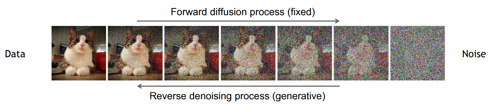

---

### Forward Process

- ###### The definition of the forward process in T steps:

    - Posterior: $q(x_{1:T} | x_0 ) = \prod^T_{t=1} q(x_t \vert x_{t-1})$,
    - where $q(x_t \vert x_{t-1}) = \mathcal{N}(x_t; \sqrt{1-\beta_t}x_{t-1}, \beta_t I)$
    -  We will often denote $a_t = 1 - \beta_t$

 

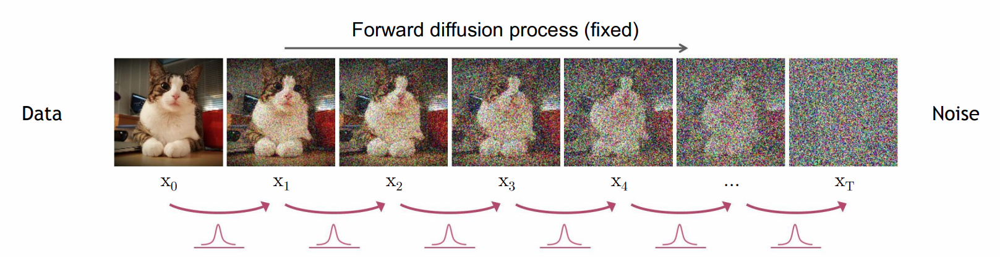

---
### Characteristics of the forward process

- Markov Chain.
- Generally $\beta_t \in (0,1)$ follows a fixed linearly increasing schedule.
- As $T\rightarrow \infty$, $q(x_t|x_0) \approx \mathcal{N}(0,I)$.
- If we set a large enough $T$ we can set $\beta_t\ll1$. 

---
### Backward Process

-  We have to approximate $q(x_{t-1} | x_t)$. 

-  We can model $q(x_{t-1} | x_t)$ as a Normal Distribution if $\beta_t$ is small. 

---

#### Definition of the Backward Process

-  We will model the true reverce process $q(x_{t-1}|x_t)$ with $p_{\theta}(x_{t-1}|x_t)$. 

- $p_{\theta}(x_T) = \mathcal{N}(x_T; 0, I).$
- $p_{\theta}(x_{t-1}|x_t) = \mathcal{N}(x_{t-1}; \mu_{\theta}(x_t,t), \sigma_t^2 I)$
---

#### What objective will we optimize?

-  Maximize $p_{\theta}(x_0) ?$ 

- $p_{\theta}(x_0) = \int p_{\theta}(x_{0:T})dx_{1:T}$  

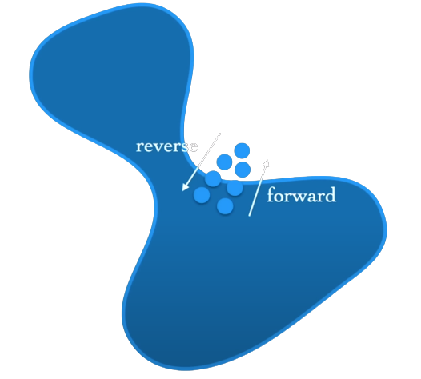

---

#### What objective will we optimize?

- Marginalizing oven all possile trajectories is intracable.
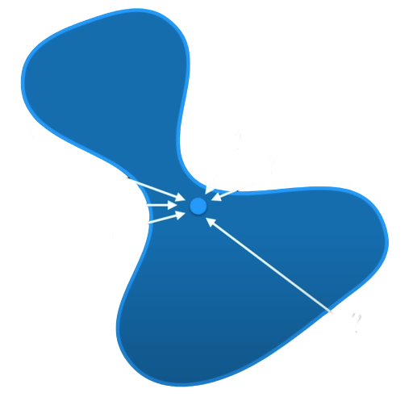

- $p_{\theta}(x_0) = \int p_{\theta}(x_{0:T})\underline{dx_{1:T}}$  

---
#### What objective will we optimize?

-  View $x_1, x_2, ... x_T$ as latent varables .
-  And $x_0$ as the observed variable.
-  Maximize an Evidence Lower Bound (ELBO)
---

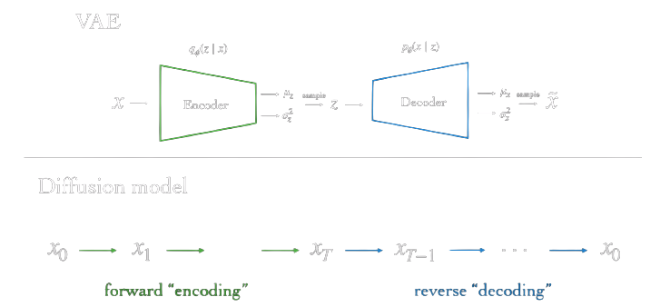

---

##### Maximize the ELBO

-   $\log p(x) \geq \text{ELBO}$ 
<!-- - The evidence  is quantified as the log likelihood of the observed data $\log p(x)$. -->
- Maximizing the ELBO becomes a proxy objective with which to optimize a latent variable model.
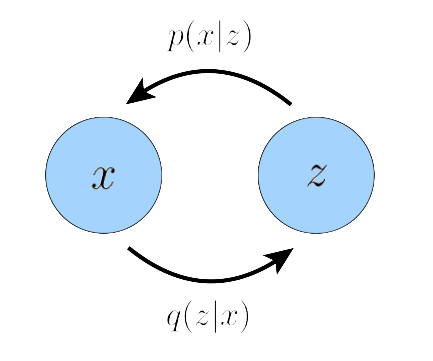

---

## Derivation of ELBO in VAEs

$$
\begin{align}\log p(x) &=  \int \log p(x) q_{\phi}(z|x)dz && (\int q(z|x) dz = 1)\\

&=\mathbb{E}_{q_{\phi}(z|x)}[\log p(x)] && (\text{By Definition of } \mathbb{E}) \\
&=\mathbb{E}_{q_{\phi}(z|x)}[\log \frac{p(x,z)}{p(z|x)}] && (\text{Chain rule})\\
&=\mathbb{E}_{q_{\phi}(z|x)}[\log \frac{p(x,z)}{q_{\phi}(z|x)}] + \mathbb{E}_{q_{\phi}(z|x)}[\log \frac{q_{\phi}(z|x)}{p(z|x)}] && (\text{Multiple by } \frac{q_{\phi}(z|x)}{q_{\phi}(z|x)} \text{ and split})\\
&=\mathbb{E}_{q_{\phi}(z|x)}[\log \frac{p(x,z)}{q_{\phi}(z|x)}] + D_{KL}(q_{\phi}(z|x)||p(z|x)) && (\text{By definition of } D_{KL}) \\
&\geq \mathbb{E}_{q_{\phi}(z|x)}[\log \frac{p(x,z)}{q_{\phi}(z|x)}] && (D_{KL} > 0)

\end{align}
$$

---

##### Diffusion Models as Hierarchical VAEs

 Two diffrences:

-   The latent dimension is exactly equal to the data dimension.
-  Encoders $q$  are not learned; **pre-defined** as a linear Gaussian model.
---

## An ELBO for the Diffusion Model

$$
\begin{align}\log p(x) &\geq  \mathbb{E}_{q(x_{1:T}|x_0)}\left[ \log \frac{p(x_{0:T})}{q(x_{1:T}|x_0)} \right ]\\

&= \mathbb{E}_{q(x_{1:T}|x_0)}  \left[log \frac{p(x_T) \prod_{t=1}^T p_{\theta}(x_{t-1}|x_t)}{\prod_{t=1}^T q(x_t|x_{t-1}, \mathbin{\color{red}x_0})}\right]  && (\text{Due to Markovian Property }\mathbin{\color{red}q(x_t|x_{t-1}) = q(x_t|x_{t-1},x_0)})\\

&= \mathbb{E}_{q(x_{1:T}|x_0)}  \left[ 
\log \frac{p_{\theta}(x_T) p_{\theta}(x_0|x_1)}{q(x_1|x_0)} + \log \prod_{t=2}^T  \frac{p_{\theta}(x_{t-1}|x_t)}{q(x_t|x_{t-1},x_0)} 
\right] && (\text{1st term out of product and split.})\\

&= \mathbb{E}_{q(x_{1:T}|x_0)}  \left[ 
\log \frac{p_{\theta}(x_T) p_{\theta}(x_0|x_1)}{q(x_1|x_0)} +
\log \prod_{t=2}^T  
\frac{p_{\theta}(x_{t-1}|x_t)}{\frac{q(x_{t-1}|x_T,x_0) \mathbin{\color{green}q(x_t|x_0)} }
{\mathbin{\color{green}q(x_{t-1}|x_0)}}} 
\right] && (\text{Bayes rule}) \\

&= \mathbb{E}_{q(x_{1:T}|x_0)}  \left[ 
\log \frac{p_{\theta}(x_T) p_{\theta}(x_0|x_1)}{q(x_1|x_0)} +
\log(\frac{\mathbin{\color{green}q(x_1|x_0)}}{\mathbin{\color{green}q(x_T|x_0)}})
+\log \prod_{t=2}^T  \frac{p_{\theta}(x_{t-1}|x_t)}{q(x_t|x_{t-1},x_0)} 
\right] &&
(\mathbin{\color{green}\text{Only the first and last term survive.}}) \\

&= \mathbb{E}_{q(x_1|x_0)}  
\left[ 
\log  p_{\theta}(x_0|x_1)
\right] +

\mathbb{E}_{q(x_T|x_0)}  
\left[ 
\log  \frac{p_{\theta}(x_T)}{q(x_T|x_0)}
\right] +
\sum_{t=2}^T \log \frac{p_{\theta}(x_{t-1}|x_t)}{q(x_t|x_{t-1},x_0)} && (\text{Get log inside product})
\end{align}
$$

---

### An ELBO for the Diffusion Model

 
 

$$
\begin{align}
\log p(x) &\geq 
\mathbb{E}_{q(x_1|x_0)}  
\left[ 
\log  p_{\theta}(x_0|x_1)
\right] && (L_0:\text{ Reconstruction term})\\
&-
D_{KL}(q(x_T|x_0) || p(x_T)) && (L_T:\text{Prior matchng term}) \\

&-
\sum_{t=2}^T  \mathbb{E}_{q(x_t|x_0)}
\left[
D_{KL}(q(x_{t-1}|x_t, x_0) || p_{\theta}(x_{t-1} | x_t))
\right]
&& (L_{t-1}:\text{Denoising matching term}) \\

\end{align}
$$

 
 

- $L_0$: Can be approximated and optimized using a Monte Carlo estimate.
- $L_T$: Equal to zero under our assumptions since $q(x_T | x_0) \approx p(x_T) = \mathcal{N}(0,I)$
- $L_{t-1}$: Denoising transition step $p_{\theta}(x_{t-1}|x_t)$ is learned as an approximation to tractable, ground-truth denoising transition step $q(x_{t-1}|x_t, x_0)$.

---

### What objective will we optimize?

- In this derivation the bulk of the cost lies in $L_{t-1}$.
- If we find a closed form for  $q(x_{t-1}|x_t, x_0)$ we can compute the KL Divergance and maximize the ELBO.
- By Bayes rule we have $q(x_{t-1}|x_t,x_0) = \frac{q(x_t|x_{t-1},x_0) q(x_{t-1}|x_0)}{q(x_t|x_0)}$.

 - We already know that $q(x_t|x_{t-1},x_0) = q(x_t|x_{t-1}) = \mathcal{N}(x_t ; \sqrt{a_t}x_{t},(1-a_t)I)$
 
- What about $q(x_t|x_0)$ and $q(x_{t-1}|x_0)$ ?

---

###  Reparameterization trick 

 Under the reparameterization trick, samples $x_t \sim q(x_t|x_{t-1})$ can be rewritten as:

$$
\begin{align}
x_t = \sqrt{a_t}x_{t-1} + \sqrt{1-a_t}e && \text{with } e \sim \mathcal{N}(0,1)
\end{align}
$$

Thus, $q(x_t|x_0)$ can be recursively derived through repeated applications of the reparameterization trick. Assuming acess to $2T$ random variables $\{ e_t^*, e_t\}_{t=0}^T \sim \mathcal{N}(0,1)$.

$$
\begin{align}
x_t &= \sqrt{a_t}x_{t-1} + \sqrt{1-a_t}e^*_{t-1} \\
 &= \sqrt{a_t} \left( \sqrt{a_{t-1}}x_{t-2} + \sqrt{1-a_{t-1}} e_{t-2}^* \right) + \sqrt{1-a_t}e^*_{t-1} \\ &= \sqrt{a_t a_{t-1}}x_{t-2} + \sqrt{a_t-a_ta_{t-1}}e^*_{t-2} + \sqrt{1-a_t}e^*_{t-1} \\
&= \sqrt{a_t a_{t-1}}x_{t-2} + \sqrt{1 - a_ta_{t-1}} e_{t-2} &&  (\text{Sum of Gaussians})  \\
&=  \; \; \; ... \\
&= \sqrt{\bar{a_t}}x_0 + \sqrt{1-\bar{a_t}}e_0

\end{align}
$$

---

### Now we can calculate the form of $q(x_{t-1}|x_t, x_0)$ . . .  

$$
\begin{align}
q(x_{t-1}|x_t,x_0) &= \frac{q(x_t|x_{t-1},x_0) q(x_{t-1}|x_0)}{q(x_t|x_0)} \\
&= \frac{\mathcal{N}(x_t; \sqrt{a_t}x_t, (1-a_t)I) \; \; \mathcal{N}(x_{t-1}; \sqrt{\bar{a}_{t-1}}x_0, (1-\bar{a}_{t-1}) I ) }{\mathcal{N}(x_{t}; \sqrt{\bar{a}_t}x_0, (1-\bar{a}_t) I )} \\
&= \; \; ...  \\

&= \mathcal{N}(x_{t-1};
\underbrace{\frac{\sqrt{a_t} (1-\bar{a}_{t-1})x_t + \sqrt{\bar{a}_{t-1}}(1-a_t)x_0}
{1- \bar{a}_t}}_{\mu_q(x_t,x_0)},
\underbrace{\frac{(1-a_t) (1-\bar{a}_{t-1})}{(1-\bar{a}_t)}I}_{\sum_q(t)}
)
\end{align}
$$

---

### . . . and maximize the ELBO by minimizing the $D_{KL}$
 
 

$$
\begin{align}
&\text{argmin}_{\theta} \; D_{KL}(q(x_{t-1}|x_t, x_0) \; || \; p_{\theta}(x_{t-1} | x_t)) \\
= \; &\text{argmin}_{\theta} \; D_{KL}(\mathcal{N}(x_{t-1}; \mu_q(t), \Sigma_q(t)) \; || \;  \mathcal{N}(x_{t-1}; \mu_{\theta}(t), \Sigma_{q}(t))) && \text{(set denoising transition variance to be $Σ_q(t)$)} \\   
= \; & \;\; . . . && (\text{KL Divergence Gaussians}) \\
= \; &\text{argmin}_{\theta} \; \frac{1}{2\sigma_q^2(t)} 
\left[
|| \mu_{\theta} - \mu_q||_2^2
\right]
\\ 

\end{align}
$$

We want to optimize $µ_{\theta}(x_t, t)$ to matches $\mu_q(x_t, x_0)$.

---

### . . . and maximize the ELBO by minimizing the $D_{KL}$

We can match $\mu_{\theta}$ and $\mu_{q}$ as close as possible:

$\mu_q(x_t, x_0) = \frac{\sqrt{a_t} (1-\bar{a}_{t-1})x_t + \sqrt{\bar{a}_{t-1}}(1-a_t)\mathbin{\color{green}x_0}}
{1- \bar{a}_t}$,

$\mu_{\theta}(x_t,t) = \frac{\sqrt{a_t} (1-\bar{a}_{t-1})x_t + \sqrt{\bar{a}_{t-1}}(1-a_t)\mathbin{\color{green}\mathbf{x_{\theta}(x_t,t)}}}
{1- \bar{a}_t}$

$x_{\theta}(x_t, t)$ is parameterized by a neural network that seeks to predict $x_0$ from noisy image $x_t$ and time index t. So finaly we can write:

$
\text{argmin}_{\theta} =
\frac
  {\bar{a}_{t-1}(1-a_t)^2}
  {2\sigma_q^2(t)(1-\bar{a}_t)^2}
\left[
|| x_{\theta}(x_t,t) - x_0||_2^2
\right]
$

---

### Simplified Loss

We can choose the parameterization:

$
x_0 = \frac
  {x_t = \sqrt{1-\bar{a}_t}\epsilon_0}
  {\sqrt{\bar{a}_t}}
$

$\mu_{\theta}$ and $\mu_{q}$ become:

$
\mu_q(x_t, x_0) = 
\frac{1}{\sqrt{a_t}}x_t -\frac{1-a_t}{\sqrt{1-\bar{a}_t} \sqrt{a}_t} \mathbin{\color{green}\epsilon_0}
$

$
\mu_{\theta}(x_t, t) = 
\frac{1}{\sqrt{a_t}}x_t -\frac{1-a_t}{\sqrt{1-\bar{a}_t} \sqrt{a}_t} 
\mathbin{\color{green}\epsilon_{\theta}(x_t,t)}
$

Reformulate the loss to:

 
 

$
\text{argmin}_{\theta} = 
\frac
{(1-a_t)^2}
{\underbrace{2\sigma_q^2(t) (1-\bar{a}_t)a_t}_{\lambda_t}}
\left[
||e_0 - e_{\theta}(x_t,t)||_2^2
\right]
$

- However, $\lambda_t$  is often very large for small t’s.

- Discard $\lambda_t$ and minimize a weighted version of the ELBO.

<!-- ---

### Simplified Loss
$\mathcal{L}_{Simple}(\theta) =
\mathbb{E}_{t,x_0,\epsilon}
\left[
  ||\epsilon - \epsilon_{\theta}(x_t) ||_2^2
\right]
$ -->

---
#### DDPM: Training and Sampling
 
 
 
 
 
 
 
 

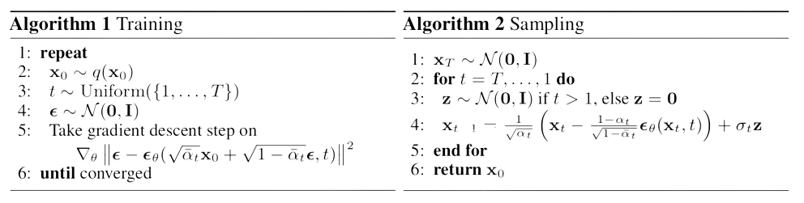

---

### DDPM: Implementation details

- A U-Net is used to estimate $\epsilon_{\theta}$
- Time information added to U-Net with positional embeddings
- Linear schudle from $\beta_1 = 10^{-4}$ to $\beta_T = 0.02$, with $T = 1000$
- These hyperparameters enusre that $a_T \rightarrow 0$ and $q(x_T | x_0) \approx \mathcal{N}(0,1)$

---

### DDPM: Predicting $\mu$ vs predicting $\epsilon$
 
 
 
 
 
 
 
 
 
 
 
 
 
 

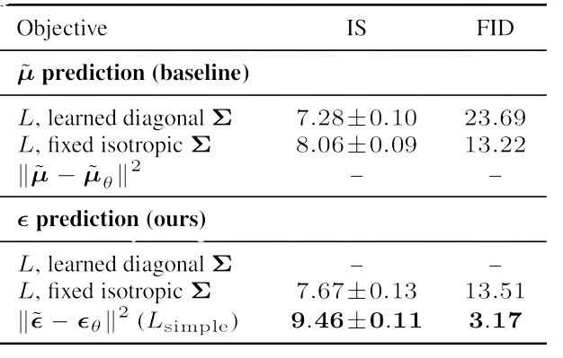

---

### Learning $\Sigma_{\theta} (x_t,t)$

- In DDPM  $\Sigma_{\theta} (x_t,t) = \Sigma(t) = \sigma^2_t I$
  - with $\sigma_t^2 = \beta_t$ or $\sigma_t^2 = \bar{\beta}_t :=  \frac{1 - \bar{a}_{t-1}}{1 - \bar{a}_t} \beta_t$
  - $\beta_t$ and $\bar{\beta}_t$ yield similar results.
 

- $\beta_t$ and $\bar{\beta}_t$ almost equal except near $t = 0$

- Learn to intertpolate $\beta_t$ and $\bar{\beta}_t$ 
  - $\sigma^2_t = \exp(v \log \beta_t + (1 − v) \log \bar{\beta}_t)$

Alex Nichol et al., 2021, Improved Denoising Diffusion Probabilistic Models

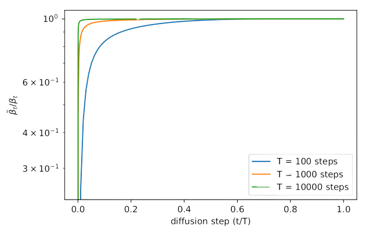

---
##### Noise Schedule

-  Problems with linear schedule.
  -  End of the forward noising process is too noisy.
  -  Doesn’t contribute very much to sample quality

-  Cosine schedule:
  -  $\bar{a}_t = \frac{f(t)}{f(0)}, \; \; f(t) = \cos^2 (\frac{t/T + s}{1+s} \cdot \frac{\pi}{2} )$

 

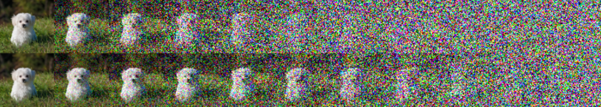

Alex Nichol et al., 2021, Improved Denoising Diffusion Probabilistic Models

---

##### Noise Schedule: Cosine vs Linear
 
 

 

 

 

 

 

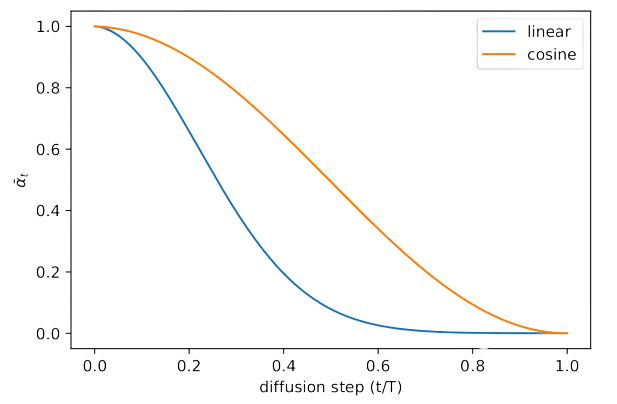
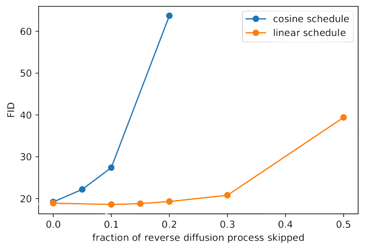

---

### Learning the Noise Schedule

 
 

 

- Recall $q(x_t|x_0) = \mathcal{N}(x_t; \; \sqrt{\bar{a}_t}x_0, (1-\bar{a})I)$

- Define $\text{SNR}=\frac{\mu^2}{\sigma^2} = \frac{\bar{a}_t}{1-\bar{a}_t}$

- Model SNR with a NN:
  - $\text{SNR}(t) = \exp(-\omega_{\phi}(t))$

  - $\bar{a}_t = \text{sigmoid}(-\omega_{\phi}(t))$

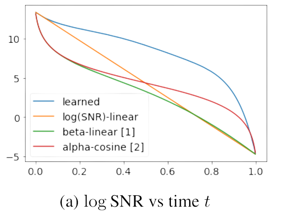

D. Kingma et al., 2021, Variational diffusion models.

---

### Latent Diffusion Models

 
 

- Run the diffusion in a latent space.
- Given an image $x \in \mathbb{R}^{H \times W \times 3}$
- Use an encoder $\mathcal{E}$ and extract $z = \mathcal{E}(x)$
- Use a decoder $\mathcal{D}$ and retreve $\hat{x} = \mathcal{D}(z)$

- $z \in \mathbb{R}^{h \times w \times c}$, with sampling rate $f = H/h = W/w = 2^m$, $m \in \mathbb{N}$.

R. Rombach et al., 2022, High-Resolution Image Synthesis with Latent Diffusion Models

